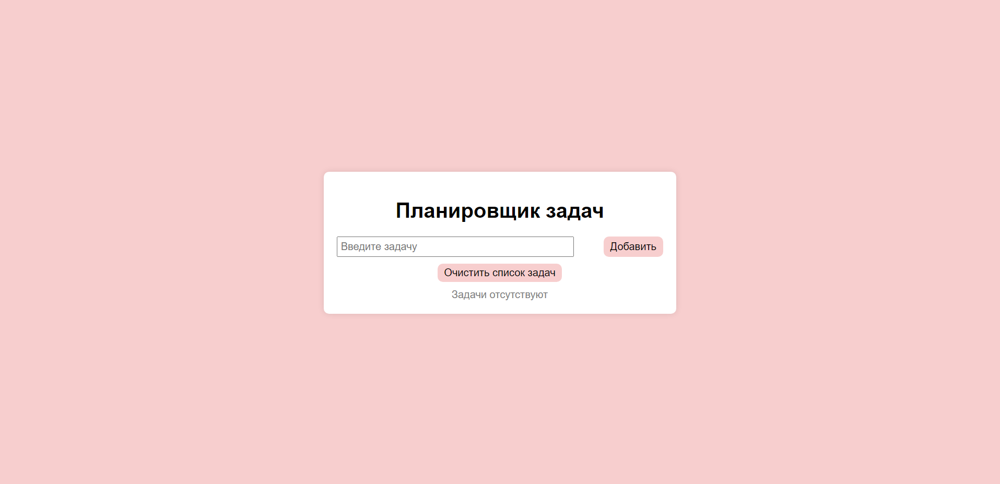
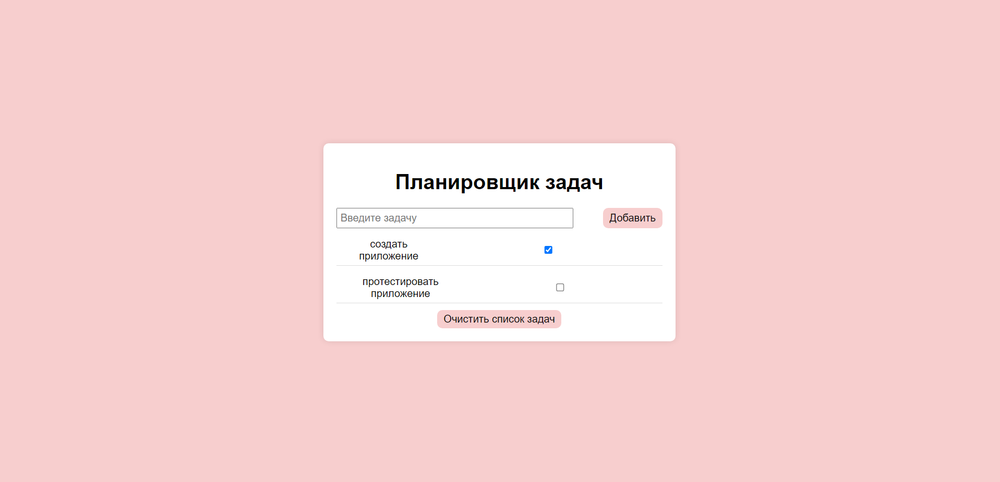

# Task Manager

Приложение «Планировщик задач».

В приложении есть input для ввода текста задачи и кнопка для её добавления в «Список задач». Ниже идет «Список задач» и кнопка «Очистить список»

Когда задач нет, идет серое уведомление о том, что задачи отсутствуют, а кнопка «Очистить список» неактивна. При добавлении задачи в список, каждая из них появляется в списке задач и напротив имеет неактивный чекбокс, а кнопка «Очистить список» активна.

Каждый чекбокс напротив задачи меняет своё состояние при клике (говоря нам, что задача выполнена).
При клике на кнопку «Очистить список» все задачи удаляются.

Для сохранения состояния списка задач между сеансами работы с приложением используется Local Storage. Это позволяет восстановить список задач при повторном открытии приложения.

# Технологии

  
 
   
  
  

